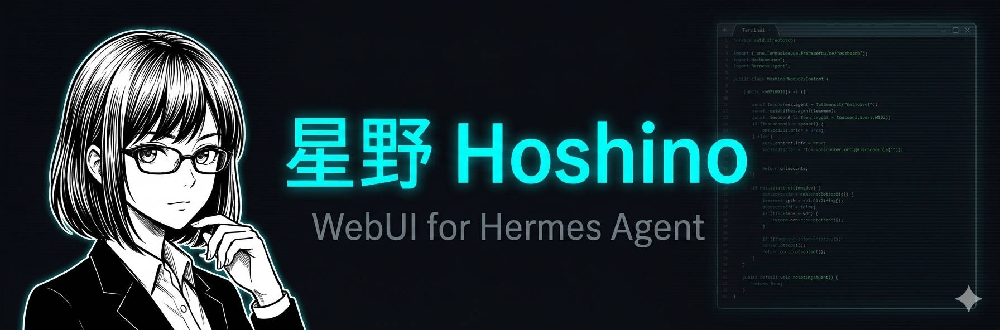

<div align="center">



# Hermes WebUI — 马鞍 Saddle

**The Saddle for Hermes — 给你的本地 AI Agent 一张脸**  
*Give your local AI agent a face*

[](LICENSE)
[](https://www.python.org)
[](https://github.com/NousResearch/hermes-agent)
[](https://ollama.ai)

</div>

---

## 这是什么？/ What is this?

[Hermes](https://github.com/NousResearch/hermes-agent) 是一个强大的开源 AI Agent，但它只能在终端里用。**Hermes WebUI（马鞍）** 给它加了一个好看的网页界面——你可以在浏览器里驱动 Agent 执行任务，编辑它的记忆，管理它的技能，还能给它起名字、换头像、改主题色。

[Hermes](https://github.com/NousResearch/hermes-agent) is a powerful open-source AI Agent that lives in the terminal. **Hermes WebUI** gives it a proper web interface — drive the agent to execute real tasks in the browser, edit its memory, manage skills, and make it truly yours with a custom name, avatar, and color theme.

> **Hermes WebUI 不替代 Hermes，它是你使用 Hermes 的界面。**  
> *Hermes WebUI doesn't replace Hermes — it's the interface you use it through.*

### 🤖 真正的 Agent，不只是聊天 / Real Agent, Not Just Chat

WebUI 直接调用本地 Hermes CLI，让 Agent 真正执行操作：

- 📁 **文件操作** — 创建、读取、修改文件
- 💻 **代码执行** — 运行 Python、Bash 脚本
- 🌐 **浏览器控制** — 自动化网页操作
- 🧠 **任务规划** — 多步骤任务自动完成
- 🔧 **技能调用** — 使用所有已安装的 Hermes Skills

只需在运行 WebUI 的机器上安装 Hermes，WebUI 就会自动检测并启用 Agent 模式。

*The WebUI calls the local Hermes CLI directly, enabling real agent actions — file operations, code execution, browser control, and more. Install Hermes on the same machine as the WebUI, and Agent mode activates automatically.*

---

## 核心亮点 / Highlights

### 🧠 与 Hermes CLI 共享同一个大脑
WebUI 和命令行读写的是**完全相同的文件**。在网页里改了记忆，终端里立刻生效；在终端里跑了任务，网页里也能看到。没有同步延迟，没有数据孤岛。

**Shares the same brain as Hermes CLI.** The WebUI and CLI read/write the exact same files. Edit memory in the browser, see it in the terminal instantly — and vice versa. No sync delay, no data silos.

### 🎨 完全属于你的 Agent 身份
给你的 Agent 起任何名字（支持中文、emoji、符号），上传任意头像，从 5 种主题色中选一个或者自定义颜色。整个界面会实时跟着变。

**A fully personalized agent identity.** Name it anything — Chinese, emoji, symbols all work. Upload any avatar. Pick from 5 color themes or go fully custom. The entire UI updates in real-time.

### 🔒 100% 本地运行，数据不出门
所有数据存在你自己的机器上（`~/.hermes/` 和 `~/.hermes-webui/`），没有云端服务器，没有账号注册，没有数据上传。断网也能用。

**Runs 100% locally.** All data lives on your machine (`~/.hermes/` and `~/.hermes-webui/`). No cloud server, no account, no data upload. Works offline.

### 🔐 Token 认证保护 API
后端默认启用 Bearer Token 认证，Token 自动生成并存储在 `~/.hermes-webui/auth_token`，启动日志中会打印。可通过 `--no-auth` 参数禁用。

**Token-based API auth.** The backend auto-generates a Bearer token stored at `~/.hermes-webui/auth_token`. Shown in startup logs. Disable with `--no-auth`.

### 🤖 支持所有 Ollama 模型
Gemma、Llama、Qwen、DeepSeek……只要 Ollama 能跑的模型，Hermes WebUI 都支持，随时切换，无需重启。

**Works with any Ollama model.** Gemma, Llama, Qwen, DeepSeek — if Ollama can run it, Hermes WebUI supports it. Switch models on the fly without restarting.

### ⚡ 一键启动，开箱即用
Windows 双击 `launch.bat`，Linux/Mac 运行 `./scripts/start.sh`，自动创建虚拟环境、安装依赖、启动服务。

**One-click start.** Double-click `launch.bat` on Windows or run `./scripts/start.sh` on Linux/Mac. Auto-creates venv, installs deps, starts the server.

---

## 快速开始 / Quick Start

### 环境要求 / Prerequisites

| 组件 | 必需 | 说明 |
|------|------|------|
| [Python 3.10+](https://www.python.org) | ✅ | 运行后端服务 |
| [Ollama](https://ollama.ai) | ✅ | 本地模型推理 |
| [Hermes](https://github.com/NousResearch/hermes-agent) | 推荐 | Agent 执行引擎（文件操作、代码执行等）|

> **没有 Hermes CLI 也能启动**，但只能查看记忆和技能，无法执行 Agent 任务。  
> *WebUI starts without Hermes CLI, but Agent execution requires it.*

### 安装并启动 / Install & Start

```bash
# 1. 克隆项目
git clone https://github.com/songchao4218/hermes-webui.git
cd hermes-webui

# 2. 启动
# Windows: 双击 launch.bat
# macOS:   ./scripts/install-macos.sh
# Linux:   ./scripts/start.sh
```

**启动方式 / Launch:**

| 平台 | 命令 | 说明 |
|-----|------|------|
| Windows | 双击 `launch.bat` | 自动检测 Python、创建虚拟环境、安装依赖、找空闲端口、启动服务 |
| macOS | `./scripts/install-macos.sh` | 智能检测：硬件评分 → 推荐模型 → 自动安装 → 配置远程（可选）|
| Linux | `./scripts/start.sh` | 标准启动，需提前安装 Hermes 和 Ollama |

然后打开浏览器访问 **http://localhost:8080**

首次启动会进入引导设置向导，帮你配置 Agent 名称、头像和主题色。

### 手动启动后端 / Manual Start

```bash
cd backend
pip install -r requirements.txt
python app.py
# 或禁用认证（开发/测试用）
python app.py --no-auth
```

启动日志中会打印 Auth Token，前端会自动从 `localStorage` 读取并注入请求头。

### 下载模型 / Pull a Model

```bash
ollama pull gemma3:12b    # 推荐
ollama pull llama3.2:3b
ollama pull qwen2.5:7b
ollama pull deepseek-r1:8b
```

---

## 功能列表 / Features

| 功能 | 说明 |
|------|------|
| 💬 **聊天界面** | 多会话、历史持久化、延迟显示、流式响应（SSE） |
| 🤖 **智能路由** | 自动判断意图：普通对话走 Ollama，文件/代码/工具操作自动切换 Agent 模式 |
| 🧠 **记忆编辑器** | 直接编辑 SOUL.md、MEMORY.md、USER.md，与 Hermes CLI 实时同步 |
| ⚡ **技能浏览器** | 查看已安装 Hermes Skill，支持 ZIP 包导入 |
| 🎨 **动态主题** | 5 种预设主题色（amber/cyan/purple/green/rose）+ 自定义颜色 |
| 👤 **身份定制** | Agent 名称、头像、副标题；User 名称、头像，全部可配置 |
| 🔄 **模型切换** | 顶栏下拉菜单，随时切换 Ollama 模型，无需重启 |
| 🌐 **中英双语** | 自动检测浏览器语言，支持中文/英文切换 |
| 🔐 **Token 认证** | Bearer Token 保护所有 API，自动生成，支持 `--no-auth` 禁用 |
| 🐳 **Docker 支持** | 完整 docker-compose 配置，挂载 `~/.hermes` 和 `~/.hermes-webui` |
| 🔄 **一键自动更新** | Support 页面检测 GitHub 新版本，流式输出 git pull 日志，一键更新 |
| 🪟 **WSL2 路径转换** | 自动检测 WSL2 环境，Windows 路径与 WSL 路径双向转换 |

---

## 记忆系统 / Memory System

Hermes WebUI 直接读写 Hermes 的记忆文件，CLI 和 WebUI 共享同一份数据：

| 文件 | 用途 | 路径 |
|------|------|------|
| `SOUL.md` | Agent 的个性、价值观、行为规则 | `~/.hermes/SOUL.md` |
| `MEMORY.md` | 累积的知识和上下文 | `~/.hermes/memories/MEMORY.md` |
| `USER.md` | 用户信息 | `~/.hermes/memories/USER.md` |

在网页的 Memory 标签页里编辑这些文件，Hermes CLI 会立即看到变化。

---

## 架构 / Architecture

```
┌─────────────┐     ┌──────────────────────┐     ┌─────────────┐
│   Browser   │────▶│   FastAPI Backend    │────▶│   Ollama    │
│  (单文件SPA) │◀────│   (auth + CORS)      │◀────│  (Local)    │
└─────────────┘     └──────────┬───────────┘     └─────────────┘
                               │
                    ┌──────────▼───────────┐
                    │  HermesBridge        │  ◀── 读写 Hermes 文件
                    │  WSLBridge           │  ◀── WSL2 路径转换
                    └──────────┬───────────┘
                               │
              ┌────────────────┴────────────────┐
              │                                 │
   ┌──────────▼───────────┐       ┌─────────────▼──────────┐
   │  ~/.hermes/          │       │  ~/.hermes-webui/       │
   │  ├─ SOUL.md          │       │  ├─ persona.json        │
   │  ├─ memories/        │       │  ├─ auth_token          │
   │  ├─ skills/          │       │  ├─ avatar/             │
   │  └─ state.db         │       │  └─ sessions/           │
   │  (与 CLI 共享)        │       │  (WebUI 专属)           │
   └──────────────────────┘       └────────────────────────┘
```

---

## 配置 / Configuration

Hermes WebUI 会自动读取 Hermes 的配置，通常不需要手动配置。如需自定义：

```yaml
# config/hermes-webui.yaml 或 ~/.hermes-webui/config.yaml

server:
  host: 0.0.0.0
  port: 8080

# 手动指定 Ollama 地址（远程服务器或 WSL 网络）
# ollama_url: http://192.168.1.100:11434
```

也可通过环境变量覆盖（优先级最高）：

```bash
OLLAMA_BASE_URL=http://192.168.1.100:11434
HERMES_CORS_ORIGINS=http://192.168.1.100:8080
```

### Docker / Docker Compose

```bash
docker-compose up -d
# WebUI: http://localhost:8080
# Ollama 默认连接宿主机: http://host.docker.internal:11434
```

---

## 项目结构 / Project Structure

```
hermes-webui/
├── backend/
│   ├── app.py              # FastAPI 后端，所有 API 接口
│   ├── auth.py             # Token 认证模块（Bearer Token）
│   ├── hermes_bridge.py    # 与 Hermes 记忆/技能系统的桥接层
│   ├── wsl_bridge.py       # WSL2 Windows 路径转换桥接
│   ├── models.py           # Pydantic 请求/响应模型（输入校验）
│   ├── hermes_wrapper.bat  # Windows 下调用 WSL Hermes 的包装脚本
│   └── requirements.txt
├── frontend/
│   ├── index.html          # 单文件前端（聊天、技能、记忆、设置）
│   └── assets/
│       ├── js/
│       │   ├── api.js      # 统一 API 客户端（自动注入 Auth Token）
│       │   ├── theme.js    # 动态主题引擎
│       │   └── utils.js    # 工具函数
│       └── i18n.js         # 国际化（中文/英文）
├── tests/
│   ├── conftest.py         # pytest fixtures（TestClient、auth 控制）
│   ├── test_auth.py        # 认证模块测试
│   ├── test_memories.py    # 记忆读写 + 技能接口测试
│   ├── test_persona.py     # 身份定制接口测试
│   ├── test_security.py    # 安全测试（路径穿越、输入校验）
│   └── test_sessions.py    # 会话管理测试
├── config/
│   └── hermes-webui.yaml   # 配置模板
├── scripts/
│   ├── install.sh          # 跨平台安装脚本
│   ├── install-macos.sh    # macOS 专用（硬件检测+模型推荐）
│   └── start.sh            # Linux 启动脚本
├── docs/
│   ├── DESIGN.md           # UI 设计系统文档
│   └── banner.png
├── launch.bat              # Windows 双击启动入口
├── scripts/
│   ├── start-windows.bat   # Windows 启动脚本（launch.bat 调用此文件）
├── docker-compose.yml
└── .env.example            # 环境变量示例
```

---

## 测试 / Testing

项目使用 **pytest** + **FastAPI TestClient**，覆盖认证、记忆、身份、安全、会话五个模块。

### 安装测试依赖

```bash
pip install -r backend/requirements.txt
# 已包含 pytest>=7.0 和 pytest-asyncio>=0.21
```

### 运行所有测试

```bash
pytest tests/ -v
```

### 运行单个模块

```bash
pytest tests/test_auth.py -v        # 认证测试
pytest tests/test_memories.py -v    # 记忆 + 技能测试
pytest tests/test_persona.py -v     # 身份定制测试
pytest tests/test_security.py -v    # 安全测试
pytest tests/test_sessions.py -v    # 会话管理测试
```

### 测试覆盖范围

| 测试文件 | 覆盖内容 |
|---------|---------|
| `test_auth.py` | Token 生成、持久化、Bearer 认证、401 拒绝 |
| `test_memories.py` | 读写 SOUL/MEMORY/USER.md、非法文件名拒绝、内容长度校验 |
| `test_persona.py` | 获取/更新 Agent 名称、主题预设、自定义颜色、setup_complete |
| `test_security.py` | 头像路径穿越防护、空消息拒绝、超长输入拒绝 |
| `test_sessions.py` | 创建/列出/获取消息/删除会话 |

> 测试默认禁用认证（`conftest.py` 中 `autouse` fixture 自动处理），无需手动传 Token。

---

## 路线图 / Roadmap

- [x] 聊天界面 + 记忆同步
- [x] Agent / User 身份定制（名称、头像、主题色）
- [x] 引导式设置向导（Onboarding Wizard）
- [x] 记忆编辑器（SOUL.md / MEMORY.md / USER.md）
- [x] 技能浏览器 + ZIP 导入
- [x] 模型切换器
- [x] 多会话 + 历史持久化（`~/.hermes-webui/sessions/`）
- [x] 动态主题引擎（5 预设 + 自定义）
- [x] Docker 支持
- [x] 中英双语界面（自动检测浏览器语言）
- [x] 流式响应（SSE）
- [x] Token 认证（Bearer Token，支持 `--no-auth`）
- [x] Windows 全自动安装向导（WSL2 + Hermes + Ollama + 模型）
- [x] WSL2 Windows 路径自动转换
- [x] macOS 即开即用（硬件检测 + 智能模型推荐 + 远程 Ollama）
- [x] 一键自动更新（流式输出 git pull 日志）
- [x] 完整测试套件（pytest，覆盖认证/记忆/安全/会话）
- [x] **智能路由**（关键词+LLM意图分类，自动切换 Chat / Agent 模式）
- [x] **WSL2 Windows 路径注入**（Agent 模式自动感知 Windows 文件系统）
- [ ] 语音输入 / 输出
- [ ] 移动端适配

---

## 致谢 / Credits

- [Hermes](https://github.com/NousResearch/hermes-agent) — Agent 框架
- [Ollama](https://ollama.ai) — 本地模型推理
- [FastAPI](https://fastapi.tiangolo.com) — 后端框架
- [Tailwind CSS](https://tailwindcss.com) — 前端样式
- [Google Stitch](https://stitch.withgoogle.com) — UI 设计灵感

---

## 许可证 / License

MIT — 随便用，随便改。详见 [LICENSE](LICENSE)。  
*MIT — use it, fork it, build on it. See [LICENSE](LICENSE).*

---

<div align="center">

**你的 Agent，你的数据，你的机器。**  
*Your agent. Your data. Your machine.*

</div>
